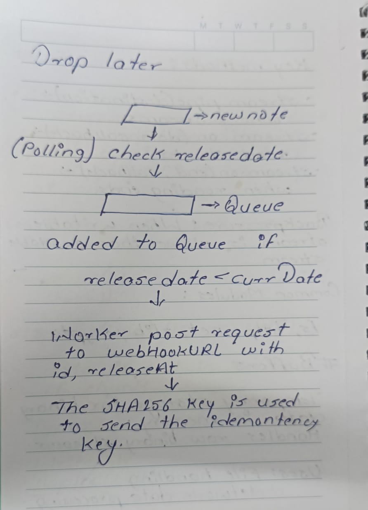
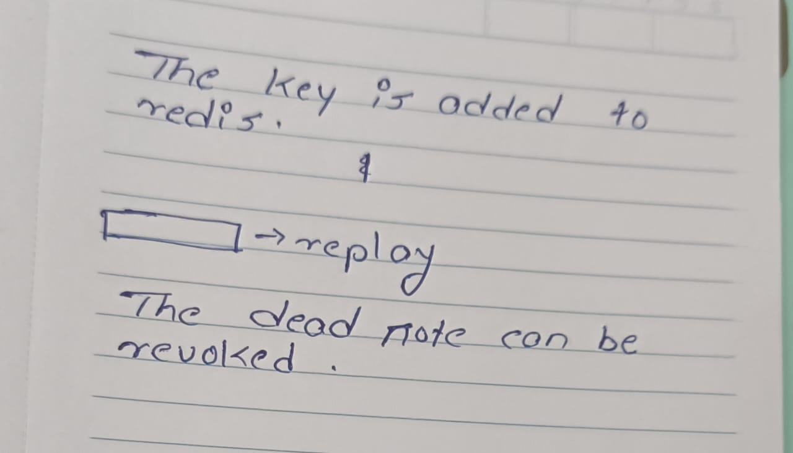

 <h1>📝 Notes Queue Service</h1>

  

    A small service where users create <b>“notes”</b> that should be sent to a <b>webhook</b> at/after a time.  
    Delivery is <b>exactly once (idempotent)</b>, with <b>retries on failure</b>, and includes a <b>tiny admin UI</b> to create, list, and replay notes.
  

  <h2>⚡ Features</h2>
  <ul>
    <li>Queue management using <b>BullMQ</b></li>
    <li>Redis-backed job scheduling</li>
    <li>Webhook delivery with retries</li>
    <li>Minimal admin UI for notes</li>
  </ul>

  <h2>📦 Tech Stack</h2>
  <ul>
    <li><b>Node.js</b> (Backend)</li>
    <li><b>React.js</b> (Frontend)</li>
    <li><b>BullMQ</b> (Job Queue)</li>
    <li><b>Redis</b> (Message Broker)</li>
  </ul>

  <h2>🚀 Setup</h2>

  <h3>1. Run Redis with Docker</h3>
  <pre>
  docker run -d --name my-redis -p 6379:6379 redis
  </pre>

  <h3>2. Install dependencies</h3>
  <pre>
  npm install
  </pre>

  <h3>3. Configure Redis Connection</h3>
  <pre>
  // redis.js
  import { Redis } from 'ioredis';

  const redis = new Redis({
    host: "127.0.0.1",
    port: 6379
  });

  export default redis;
  </pre>

  <h3>4. Create a Queue</h3>
  <pre>
  import { Queue } from "bullmq";
  import redis from "./redis.js";

  const noteQueue = new Queue("note", {
    connection: redis,
  });

  export default noteQueue;
  </pre>

  <h2>🖥️ Admin UI</h2>
  

    A simple admin interface to:
  

  <ul>
    <li>Create notes</li>
    <li>List notes</li>
    <li>Replay failed deliveries</li>
  </ul>

  <h2>🔗 Webhook Delivery</h2>
  

    Notes are delivered to the specified webhook URL with retries in case of failure.  
    Each delivery is guaranteed to be processed exactly once.
  

  <h2>📌 Example</h2>
  <pre>
  POST /api/notes
  {
    "message": "Hello from Notes Service!",
    "webhookUrl": "https://example.com/webhook",
    "sendAt": "2025-08-20T10:00:00Z"
  }
  </pre>
  
  

    
<i>Planning for Project</i>

    
    
  

  

  <h2>👨‍💻 Author</h2>
  
Developed by <b>Aryan Gidde</b>

